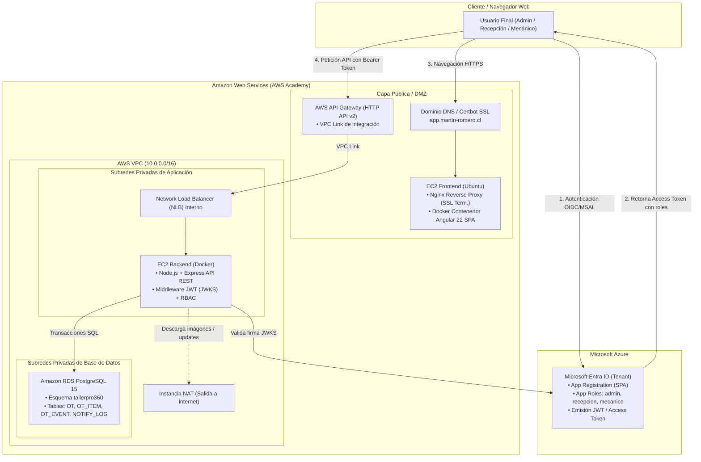
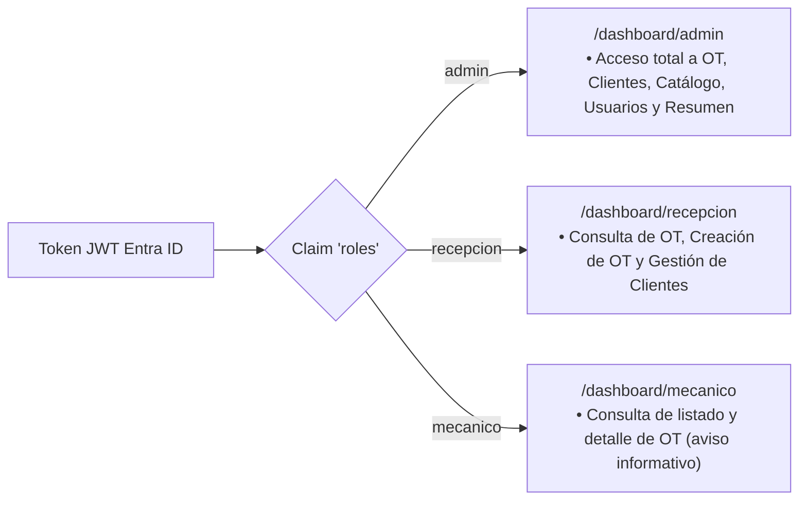

# TallerPro360 — Sistema de Gestión de Taller Mecánico Cloud Native

[](https://github.com)
[](https://aws.amazon.com)
[](frontend/README.md)
[](backend/README.md)
[](terraform/README.md)

Solución Cloud Native integral para la gestión operativa de un taller mecánico (**TallerPro360**), desarrollada en el marco de la **Evaluación Parcial N°1 (DSY1107 - Desarrollo Cloud Native I)**. 

La plataforma implementa una arquitectura híbrida/multicloud desacoplada: autenticación e identidad corporativa mediante **Microsoft Entra ID** (OAuth 2.0 / OIDC con App Roles), infraestructura aprovisionada mediante **Terraform sobre AWS Academy**, frontend moderno en **Angular 22** con dashboards diferenciados por rol, y un backend API REST en **Node.js** con control de acceso basado en roles (**RBAC**) conectado a **Amazon RDS PostgreSQL**.

---

## 🏛️ Arquitectura del Sistema



---

## 🗂️ Módulos del Repositorio

El repositorio se encuentra estructurado en módulos desacoplados y auto-contenidos:

| Directorio | Componente / Rol | Documentación |
| :--- | :--- | :--- |
| [`frontend/`](frontend/) | SPA en Angular 22 con `@azure/msal-angular`, dashboards por rol, CRUD de OT y despliegue Nginx con Certbot en AWS EC2. | [README Frontend](frontend/README.md) |
| [`backend/`](backend/) | API REST en Node.js + Express, validación JWT contra JWKS de Entra ID, autorización RBAC por verbo/recurso y persistencia en PostgreSQL. | [README Backend](backend/README.md) |
| [`terraform/`](terraform/) | Infraestructura como Código (IaC) modular para AWS: VPC, Subnets, Instancia NAT, Security Groups, EC2s, RDS, NLB y API Gateway. | [README Terraform](terraform/README.md) |
| [`azure/`](azure/) | Guía técnica para el registro en Microsoft Entra ID, definición de App Roles (`admin`, `recepcion`, `mecanico`), scopes y Redirect URIs. | [README Azure](azure/README.md) |
| [`docs/`](docs/) | Índice de documentación técnica, especificaciones de pipelines de GitHub Actions y guía de variables secretas para CI/CD. | [README Docs](docs/README.md) |

---

## 👥 Control de Acceso Basado en Roles (RBAC)

La plataforma aplica el principio de mínimo privilegio en dos capas complementarias: **Frontend UI (Gating/Dashboards)** y **Backend API (Autorización estricta por endpoint)**.



### Matriz Resumida de Permisos

| Operación / Recurso | Administrador (`admin`) | Recepcionista (`recepcion`) | Mecánico (`mecanico`) |
| :--- | :---: | :---: | :---: |
| **Listar y Ver Detalle de OT** (`GET /ot`, `GET /ot/:id`) | ✅ | ✅ | ✅ |
| **Crear Orden de Trabajo** (`POST /ot`, `POST /ot/:id/items`) | ✅ | ✅ | ❌ (403) |
| **Modificar y Eliminar OT** (`PUT /ot/:id`, `DELETE /ot/:id`) | ✅ | ❌ (403) | ❌ (403) |
| **Gestión de Clientes** (`GET`, `POST`, `PUT` en `/clientes`) | ✅ | ✅ | ❌ (403) |
| **Eliminar Cliente** (`DELETE /clientes/:id`) | ✅ | ❌ (403) | ❌ (403) |
| **Gestión de Catálogo** (`* /catalogo`) | ✅ | ❌ (403) | ❌ (403) |
| **Gestión de Usuarios** (`* /usuarios`) | ✅ | ❌ (403) | ❌ (403) |
| **Resumen Agregado de OT** (`GET /resumen`) | ✅ | ❌ (403) | ❌ (403) |

---

## 🛠️ Pila Tecnológica Completa

- **Frontend:** Angular 22 Standalone, TypeScript, `@azure/msal-browser`, `@azure/msal-angular`, CSS3 nativo sin frameworks pesados.
- **Backend:** Node.js 20+, Express.js 4, `express-jwt`, `jwks-rsa`, driver `pg` (PostgreSQL), `caseConverter` (JSON camelCase).
- **Base de Datos:** PostgreSQL 15 (Amazon RDS y contenedor local), esquema relacional `tallerpro360`.
- **Identidad & Seguridad:** Microsoft Entra ID (OIDC / OAuth 2.0), RS256 JWT, SSL/TLS Let's Encrypt (Certbot).
- **Infraestructura Cloud:** AWS Academy (VPC, NLB, EC2, RDS, API Gateway HTTP API v2, SSM Session Manager).
- **IaC & Automatización:** HashiCorp Terraform (~> 6.0), Docker, Docker Compose, GitHub Actions (CI/CD).

---

## ⚡ Guía Rápida de Inicio

### 1. Ejecución Local con Docker Compose (Backend + Base de Datos)
Para levantar la API y la base de datos PostgreSQL localmente:

```bash
cd backend
docker-compose up -d --build
```
- La API responderá en `http://localhost:8085` (con `AUTH_REQUIRED=false` por defecto para pruebas locales).

### 2. Ejecución Local del Frontend
Asegúrate de contar con Node.js 20+:

```bash
cd frontend
npm install
npm start
```
- Navega a `http://localhost:4200` para interactuar con la aplicación y autenticarte con Microsoft Entra ID.

### 3. Despliegue de Infraestructura en AWS
Para provisionar la infraestructura completa mediante Terraform:

```bash
cd terraform
terraform init
terraform plan -var-file=terraform.tfvars
terraform apply -var-file=terraform.tfvars
```
Para detalles paso a paso, consulta el documento [`terraform/README.md`](terraform/README.md).

---

## 📖 Documentación Complementaria
- [Guía de Integración con Microsoft Entra ID](azure/README.md)
- [Variables Secretas para CI/CD en GitHub Actions](docs/CI_CD_SECRETS_GUIDE.md)
- [Guía de Despliegue en AWS EC2 Frontend](frontend/DEPLOY_EC2.md)
- [Especificación de la API REST del Backend](backend/README.md)
